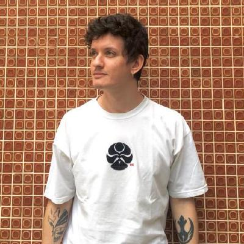

# Vestibulandos

**Número do Grupo**: 04 
**Código da Disciplina**: FGA0208-T01 

## Alunos
|Matrícula | Aluno | Foto |
| -- | -- | -- |
| 14/0139281 | [Fernando Ribeiro Aguilar](https://github.com/fernand0aguilar)||
| 15/0128312 | [Guilherme Lima Matos Leal](https://github.com/gleal17) ||
| 16/0046602 | [João Pedro de Aquino Corrêa Martins](https://github.com/jpmartins201) ||
| 16/0129443 | [Julio Cesar Litwin Lima](https://github.com/juliolitwin) ||
| 16/0133505 | [Lucas Gomes Silva](https://github.com/lucasgomesgs0)||
| 13/0132233 | [Ricardo Canela](https://github.com/ricardocanela)||

## Sobre 
O Vestibulandos é um jogo de perguntas e respostas com o intuito de tornar divertido a forma como o vestibulando estuda. Há uma interação entre vestibulandos onde podem desafiar entre si para ver quem tem maior domínio em uma ou várias áreas de conhecimento. Proporcionar para os vestibulando uma experiência em treinar para o vestibular de forma fácil, interativa e divertida.

