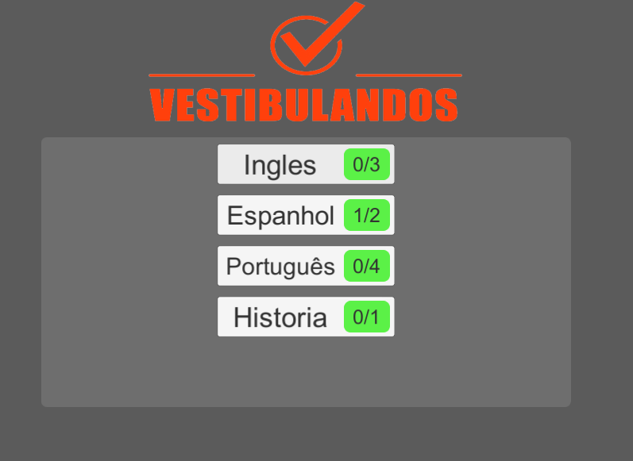
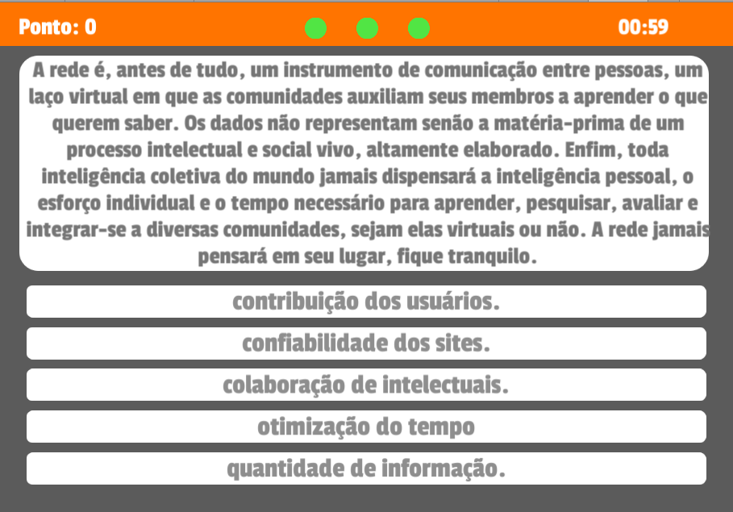
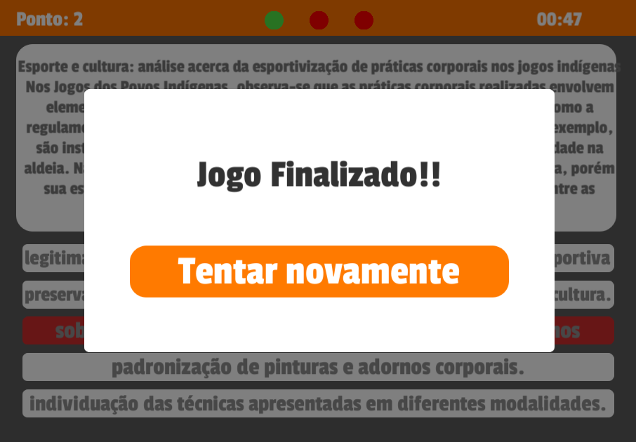

# Vestibulandos

**Número do Grupo**: 04 
**Código da Disciplina**: FGA0208-T01 

## Alunos
|Matrícula | Aluno | Foto |
| -- | -- | -- |
| 15/0128312 | [Guilherme Lima Matos Leal](https://github.com/gleal17) ||
| 16/0046602 | [João Pedro de Aquino Corrêa Martins](https://github.com/jpmartins201) ||
| 16/0129443 | [Julio Cesar Litwin Lima](https://github.com/juliolitwin) ||
| 16/0133505 | [Lucas Gomes Silva](https://github.com/lucasgomesgs0)||
| 13/0132233 | [Ricardo Canela](https://github.com/ricardocanela)||

## Sobre 
O Vestibulandos é um jogo de perguntas e respostas com o intuito de tornar divertido a forma como o vestibulando estuda. Há uma interação entre vestibulandos onde podem desafiar entre si para ver quem tem maior domínio em uma ou várias áreas de conhecimento. Proporcionar para os vestibulando uma experiência em treinar para o vestibular de forma fácil, interativa e divertida.

## Screenshots

## Instalação 
**Linguagens**: C# (.NET Core 3.1) 
**Tecnologias**: Visual Studio 2019, MSSQL 2019 e Unity 3D 2019.4.13f1  

Clone os dois repositórios a seguir:

[Frontend](https://github.com/UnBArqDsw/2020.1_G4_Vestibulandos_Frontend "Frontend")
[Backend](https://github.com/UnBArqDsw/2020.1_G4_Vestibulandos_Frontend "Backend")

## Uso

**Frontend**
Abra o projeto com a Unity 3D após instalada, após aberto, basta apenas executar o projeto a partir do botão de "PLAY".

**Backend**
Abra o projeto com o Visual Studio, o NuGET do Visual Studio automaticamente irá baixar as dependências automaticamente, após ser realizado o download, basta apenas clicar em F5 para compilar. Ambos processo possa ser relizado no LoginServer e no GameServer. Há arquivo de configuração, mas por default não é necessário realizar alteração.

**Database**
Na pasta do backend, se encontra o arquivo .sql do banco de dados, execute o script pelo o MSSQL Management.

## Vídeo
[Video de Apresentação](https://drive.google.com/file/d/1AvcS3E8-C8Gxr-JDJlDXYD3podLnqwIO/view?usp=sharing "Video de Apresentação")