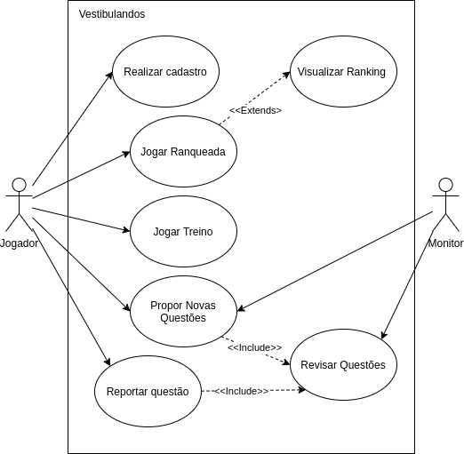
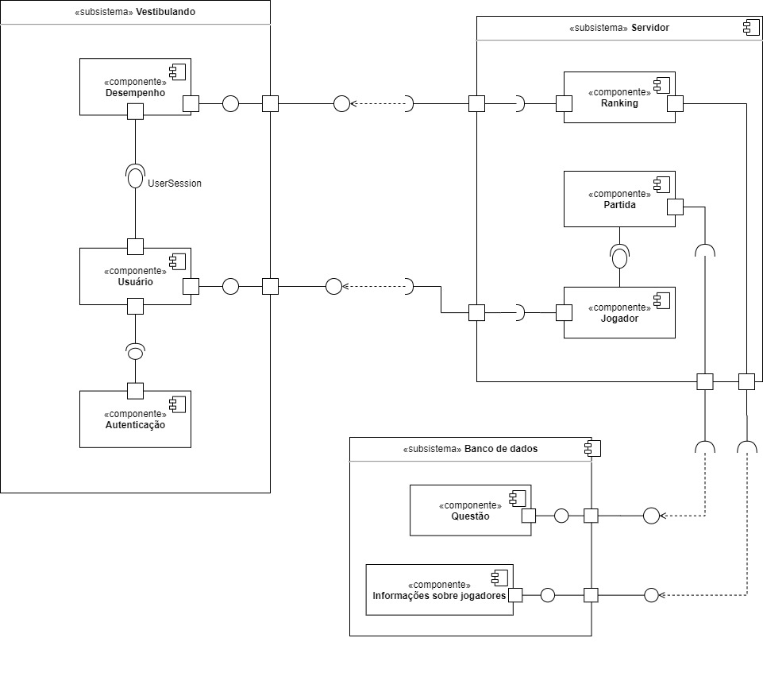
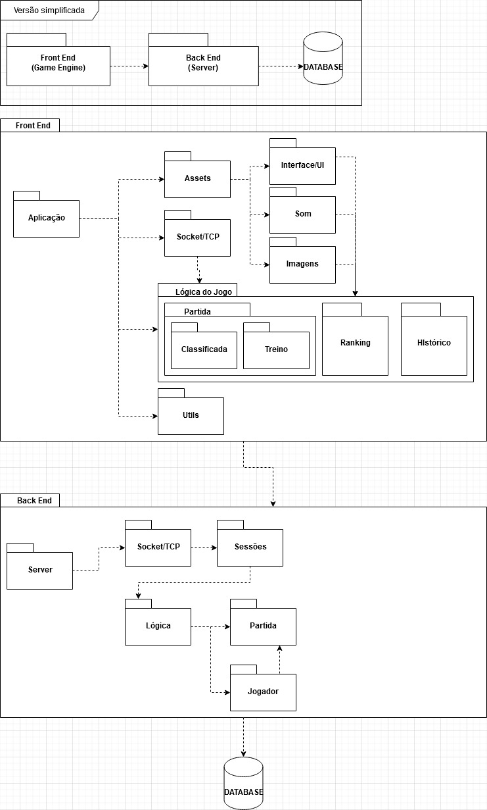
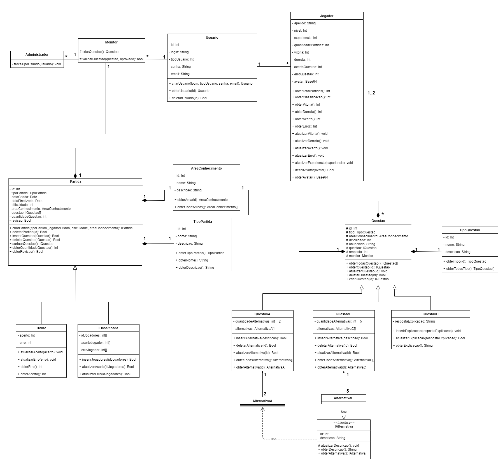

# Documento de Arquitetura de Software

## Histórico de Versões

|   Data   | Versão |           Descrição           |             Autor(es)              |
|:--------:|:------:|:-----------------------------:|:----------------------------------:|
| 19/11/2020 | 0.1 | Criado o documento | Lucas Gomes |
| 19/11/2020 | 0.2 | Adicionando introdução | João Pedro |
| 19/11/2020 | 0.3 | Adicionado imagem do visão geral da arquitetura | Julio Litwin |
| 19/11/2020 | 0.4 | Adicionado tecnologias utilizadas | Julio Litwin |
| 19/11/2020 | 0.5 | Adicionado representação arquitetural | João Pedro e Ricardo Canela |
| 20/11/2020 | 0.6 | Adicionado as metas da arquitetura | Julio Litwin |
| 20/11/2020 | 0.7 | Adicionado as restrições da arquitetura | Julio Litwin |
| 20/11/2020 | 0.8 | Adicionado mais tecnologias utilizadas. | Julio Litwin |
| 20/11/2020 | 0.9 | Adicionado tamanho e desempenho. | Julio Litwin |
| 20/11/2020 | 1.0 | Adicionado qualidade. | Julio Litwin |
| 20/11/2020 | 1.1 | Adicionado definições, acrônimos e abreviações | Ricardo Canela e Joao Pedro |
| 20/11/2020 | 1.2 | Adicionado casos de uso | Ricardo Canela e Joao Pedro |
| 20/11/2020 | 1.3 | Adicionado diagrama casos de uso, tabela de atores de caso de uso e rastreabilidade | Ricardo Canela e Joao Pedro |
| 20/11/2020 | 1.4 | Adicionado visão de implementação | Ricardo Canela e Joao Pedro |
| 20/11/2020 | 1.5 | Adicionado visão lógica | Ricardo Canela e Joao Pedro |
| 20/11/2020 | 1.6 | Adicionado diagrama de pacotes | Ricardo Canela e Joao Pedro |
| 20/11/2020 | 1.7 | Adicionado diagrama de classe | Ricardo Canela e Joao Pedro |
| 20/11/2020 | 1.8 | Adicionado rastreabilidade | Julio Litwin |

## Introdução

### Finalidade

A finalidade deste artefato é evidenciar as decisões pertinentes à arquitetura do software. Englobando desde escolhas de alto nível, tecnologias e componentes, até o nível de código. 

### Escopo
Este documento foi construído sobre a visão arquitetural utilizada na implementação do Vestibulandos. Nele serão expostas as visões de caso de uso, lógica, dados e implementação. 

### Definições, Acrônimos e Abreviações

|   Abreviação   | Significado |
|:--------:|:-----------------------------:|
| API | Application Programming Interface | 
| TCP | Transmission Control Protocol | 
| APP | Aplicação | 
| MSSQL | Microsoft Server SQL | 

## Representação Arquitetural
A arquitetura utilizada no Vestibulandos, de modo geral, segue o modelo Cliente-Servidor, sendo o responsável pela manutenção das informações (servidor) provenientes da plataforma onde ocorrem as partidas e a inserção de novas questões (cliente).

#### Visão Geral

## Metas e Restrições da Arquitetura

### Metas
- Segurança: manter as informações em segurança, tais como no próprio banco de dados e no envio/recebimento na troca de dados entre sockets.
- Multiplataforma: o frontend foi elaborado no princípio a utilização da Unity 3D, na qual além de facilitar todo o trabalho a ser escrito do zero, além da preocupação da interface e também da compilação cujos são bastante críticos.
- Linguagem de programação: utilizar apenas uma linguagem para facilitar o desenvolvimento, a linguagem usada é C# (net core).
- Monolito: o backend terá a arquitetura de monolito, cujo pelo prazo de entrega e facilidade do desenvolvimento.

### Restrições
- Conexão: é necessário o uso da internet para desfruir da aplicação.
- Idioma: aplicativo apenas foi elaborado com textos em português.
- Escalabilidade: o backend foi desenvolvido com o princípio de monolito, então desde já a ideia de escalabilidade se tornou inviável em relação a interação entre amigos.

## Tamanho e Desempenho

Descrição das principais características de tamanho do software que afetam a arquiettura, como as restrições de desempenho.

### Requisitos mínimos
#### Frontend
- Sistema operacional
-- Windows 7 ou superior
-- Linux
-- Android 10.0 ou superior
-- iOS 11.0 ou superior
- Espaço minímo disponível de 100 MB
- Conexão com internet
- Unity 3D (para desenvolvimento)

#### Backend
- Sistema operacional
-- Windows 7 ou superior
-- Linux
- Visual Studio 2019
- C# -> net core 3.1
- MSSQL 2019
- Espaço minímo de 20 GB (incluindo instalações e armazenamento de banco)

## Visão dos Casos de Uso
Estão listados abaixo os casos de uso do sistema de acordo com o [Backlog](https://unbarqdsw.github.io/2020.1_G4_Vestibulandos/modelagem/backlog)

- Realizar Cadastro
- Jogar Ranqueada
  - Visualizar [Ranking](https://unbarqdsw.github.io/2020.1_G4_Vestibulandos/modelagem/lexico)

- Jogar Treino
- Propor Novas Questões
- Reportar Questão
- Revisar Questão

### Diagrama de Casos de Uso

### Atores de Casos de Uso

|   Ator   | Descrição |
|:--------:|:-----------------------------:|
| Jogador | Pessoa que joga Vestibulando para se divertir e estudar | 
| Monitor | Pessoa que dá suporte às Questões do jogo Vestibulando | 

## Visão de Implementação

### Cliente Servidor

A arquitetura cliente-servidor é composta por duas partes interligadas entre si utilizando um meio de comunicação como rede de computadores. Nosso contexto se apresenta com o cliente sendo o Front-end do sistema, desenvolvido em Unity 3d e um servidor desenvolvido em .NET Core, sendo a comunicação feita entre eles feita através de Socket/TCP.

### Tecnologias utilizadas

##### Backend
- **Logging/Log4Net**: Gerencimento de logs no backend, tais como mostrar logs no próprio Console e/ou salvamento em arquivos. Também considerado como thread-safe, não tendo que se preocupar com race-conditions.
- **MessagePack**: Framework utilizado para serialização de dados, a serem enviados/recebidos via socket/tcp.
- **Socket/TCP**: Protoclo de controle de transmissão usado no Vestibulandos, o gerenciamento de sessões, controle de envio e recebimentos se encontra no pacote do Core.

##### Frontend
- **Unity 3D**: Game Engine utilizada para o desenvolvimento do Vestibulandos, facilitando bastante o tempo e o uso de muitos bibliotecas, como renderizações de imagens, modelos, sons e muito mais. 
- **MessagePack**: Framework utilizado para serialização de dados, a serem enviados/recebidos via socket/tcp.
- **Socket/TCP**: Protoclo de controle de transmissão usado no Vestibulandos, o gerenciamento de sessões, controle de envio e recebimentos.

##### Banco de Dados
- **MSSQL**: É um banco de dados relacional, desenvolvido pela Sybase em parceria com a Microsft. Visando utilizar tabelas e procedures, com conexões realizadas pelo LoginServer e o GameServer. Para manter dados salvos, tais como contas de usuários, questões e dentre outros. 

## Visão Lógica

### Visão Geral

A visão lógica do sistema pode ser evidenciada, no ponto de vista de arquitetura de software, em forma de divisão de componentes, conforme apresentado no diagrama a seguir.

### Diagrama de pacotes

Para uma visão mais detalhada do sistema, a documentação possui também a representação por pacotes, conforme o diagrama abaixo.

### Diagrama de Classes

O diagrama de classes está representado na imagem abaixo. Para melhor visualização, clique 
[aqui](https://unbarqdsw.github.io/2020.1_G4_Vestibulandos/img/diagramas/diagrama_de_classe_v0.png
) 

## Qualidade

Descrição de como a arquitetura do software contribui para todos os recursos (exceto a funcionalidade) do sistema: extensibilidade, confiabilidade, portabilidade e assim por diante. Se essas características tiverem significado especial, como implicações de proteção, segurança ou privacidade, elas devem ser claramente delineadas.

|   Item   |           Descrição           |
|:--------:|:-----------------------------:|
| Segurança | São realizado algumas etapas de segurança na arquitetura, partindo como persistência da dados e como são armezados e também na troca de informações entre clientes e servidores. | 
| Usuabilidade | É pensado sobre apreensibilidade, inteligibilidade e operacionalidade relacionado entre o backend e o frontend, tendo em vista sobre a complexidade do código fonte serem facilmente compreensíveis, tais como a operacionalidade entra em um fator importante, pois as tecnologias utilizadas facilitam bastante o uso, configuração do backend tem uma curva de aprendizado bem baixo. | 
| Portabilidade | Com a Unity 3D usado no frontend, são aberta várias portas para a portbilidade como Windows, Linux, Android, iOS e dentre outros, usando o mesmo código e sendo apenas necessário escolher o tipo de compilação da plataforma. O backend, sendo utilizado o C# (.NET Core), também é possível ser compilado para o Windows e Linux sem problema algum, também é possível a utilização de um Docker.  | 
| Eficiência | Backend foi desenvolvido com rápidas operações, incluindo processamento em multithread, com socket's assíncronos, troca de mensagens com o banco de dados e retorno. O tempo de resposta tende ser o mais rápido.  | 

## Rastreabilidade de Requisitos

| Épico | Requisito | Descrição|
|---|---|---|
| - | ESPS00, BR24| Desempenho|
|US01 | RF01|Login|
| US01, US02 | RF01| Autenticação|
| US04| RF03, RF08 | Partida|
| US04| RF16| Partida Rankeada|
| US04, US10, US11, US12, US19 | RF03, RF08, RF10, RF17 | Partida Treino|
| US05, US06 | RF04, RF19 | Usuário|
| US07| RF05| Área de conhecimento|
| US10-14 | RF09, RF10, RF11 |Iniciar Partida|
| US02 | RF01   |Criar Personagem|
|  US18, US22| RF16, RF21   |Acessar Ranks|
| US07| RF05| Área de conhecimento|
| US05, US06, US07, US08, US15 | RF, 04RF05,RF06,RF10,RF13, RF19| Questão|
| US16 | RF14 | Informação sobre jogares|

## Referências
- Qualidade de Software. DevMedia. Disponível em: https://www.devmedia.com.br/qualidade-de-software/9408. Acesso em: 20 de novembro. 2020.
