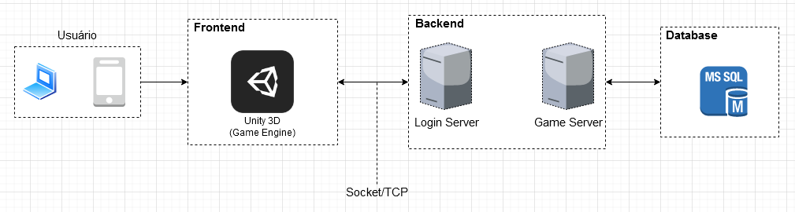

# Documento de Arquitetura de Software

## Histórico de Versões

|   Data   | Versão |           Descrição           |             Autor(es)              |
|:--------:|:------:|:-----------------------------:|:----------------------------------:|
| 19/11/2020 | 0.1 | Criado o documento | Lucas Gomes |
| 19/11/2020 | 0.2 | Adicionando introdução | João Pedro |
| 19/11/2020 | 0.3 | Adicionado imagem do visão geral da arquitetura | Julio Litwin |
| 19/11/2020 | 0.4 | Adicionado tecnologias utilizadas | Julio Litwin |
| 19/11/2020 | 0.5 | Adicionado representação arquitetural | João Pedro e Rodrigo Canela |
| 20/11/2020 | 0.6 | Adicionado as metas da arquitetura | Julio Litwin |

# Introdução

## Finalidade

A finalidade deste artefato é evidenciar as decisões pertinentes à arquitetura do software. Englobando desde escolhas de alto nível, tecnologias e componentes, até o nível de código. 

## Escopo
Este documento foi construído sobre a visão arquitetural utilizada na implementação do Vestibulandos. Nele serão expostas as visões de caso de uso, lógica, dados e implementação. 

# Representação Arquitetural
A arquitetura utilizada no Vestibulandos, de modo geral, segue o modelo Cliente-Servidor, sendo o responsável pela manutenção das informações (servidor) provenientes da plataforma onde ocorrem as partidas e a inserção de novas questões (cliente).

### Visão Geral

### Tecnologias

#### Backend

#### Frontend
- **Unity 3D**: Game Engine utilizada para o desenvolvimento do Vestibulandos, facilitando bastante o tempo e o uso de muitos bibliotecas, como renderizações de imagens, modelos, sons e muito mais. 

#### Banco de Dados
- **MSSQL**: É um banco de dados relacional, desenvolvido pela Sybase em parceria com a Microsft. Visando utilizar tabelas e procedures, com conexões realizadas pelo LoginServer e o GameServer. Para manter dados salvos, tais como contas de usuários, questões e dentre outros. 

### Metas e Restrições da Arquitetura

#### Metas
- Segurança: manter as informações em segurança, tais como no próprio banco de dados e no envio/recebimento na troca de dados entre sockets.
- Multiplataforma: o frontend foi elaborado no princípio a utilização da Unity 3D, na qual além de facilitar todo o trabalho a ser escrito do zero, além da preocupação da interface e também da compilação cujos são bastante críticos.
- Linguagem de programação: utilizar apenas uma linguagem para facilitar o desenvolvimento, a linguagem usada é C# (net core).
- Monolito: o backend terá a arquitetura de monolito, cujo pelo prazo de entrega e facilidade do desenvolvimento.

## Referências