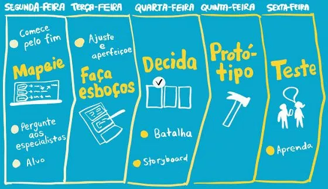

# DESIGN SPRINT

## Histórico de Versões

|   Data   | Versão |           Descrição           |             Autor(es)              |
|:--------:|:------:|:-----------------------------:|:----------------------------------:|
| 10/09/20 | 0.1 | Adicionado o documento | Julio Litwin |

## Introdução

Design Sprint é uma metodologia ágil criada em uma empresa braço do Google, a Google Ventures. O Designer Jake Knaap foi percursor do Design Sprint, em 2010, quando trabalhava no Google. Em 2012, ele levou esse jeito de trabalhar para o Google Ventures onde ele foi aperfeiçoado o processo.

A metodologia utiliza de cinco etapas, que são divididos exatamente em cinco dias, para conceber uma ideia em algo tangível e testável.

### Dia 1: Unpack (Definição)
O primeiro dia de um Design Sprint é voltado para identificação e alinhamento de um problema. É quando uma questão é levantada como prioritária e todos os participantes contribuem com suas informações sobre ela — pode ser um problema técnico, uma necessidade de iteração, uma falha de produto etc.

No primeiro dia, o grupo realizou a técnica de brainstorm para poder realizar o levantamento do escopo ao projeto, sendo discutido vários temas, dificuldades e dentre outros. Também foi realizado outras técnicas tais como 5w2h.

**Artefato(s)**:
* <em>[Brainstorming](./elicitacao/brainstorming.md)</em>
* <em>[5w2h](./pre_rastreabilidade/5w2h.md)</em>

### Dia 2: Sketch (Divergência)
Essa é a fase mais parecida com o tradicional brainstorming, sendo que a diferença está no foco em divergência. Em vez de a equipe se reunir para jogar e debater ideias, cada participante é incentivado a buscar soluções separadamente para o problema.

Dessa forma, a tendência é que cada um analise e solucione a questão baseada em seu background profissional — sem amarras, sem o medo de sugerir algo na frente de várias pessoas. Apenas quando o prazo terminar é que todas as ideias propostas serão reunidas.

No segundo dia, o grupo entrou em um consenso maior com o tema definido ao projeto, foi solicitado para cada integrante realizar um esboço para poder realizar uma versão final, foi utilizado RichPicture.

**Artefato(s)**:
* <em>[RichPicture](./pre_rastreabilidade/rich_picture.md)</em>

### Dia 3: Decide (Decisão)
Esse é o dia mais crítico do Design Sprint e não dá para perder muito tempo debatendo todas as ideias propostas. O foco precisa estar na previsão de retorno de cada sugestão em relação ao problema apresentado e, claro, a viabilidade de prototipar e testar a ideia antes que o prazo termine.

### Dia 4: Prototype (Prototipação)
Depois que a ideia é escolhida, é hora de colocá-la em prática. O objetivo de um protótipo não é terminar com um produto pronto (até porque seria impossível em um dia), mas uma representação da solução proposta com média a alta fidelidade.

### Dia 5: Test (Teste e validação)
O último dia da semana é reservado para testar, medir, analisar e aprender com o protótipo desenhado. No final do dia, ainda é possível aprimorar o que deu certo e descartar o que não for relevante.

##  Referências
- PANORAMA POSITIVO, Design Sprint: entenda o que é e como fazer. Disponível em: <https://www.meupositivo.com.br/panoramapositivo/design-sprint/>. Último acesso em: 10/09/2020.

- Chief of Design, Design Sprint – O que é e para que serve o Design Sprint Google?. Disponível em: <https://www.chiefofdesign.com.br/design-sprint/>. Último acesso em: 10/09/2020.
