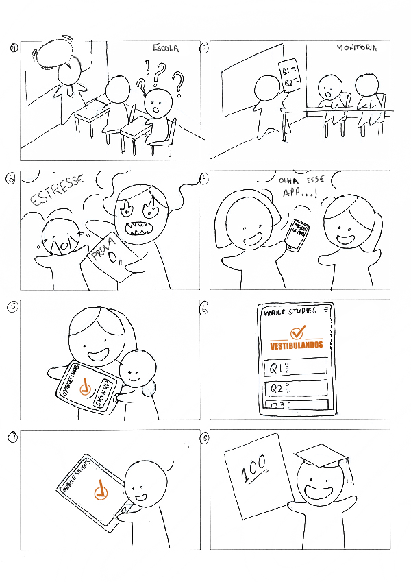
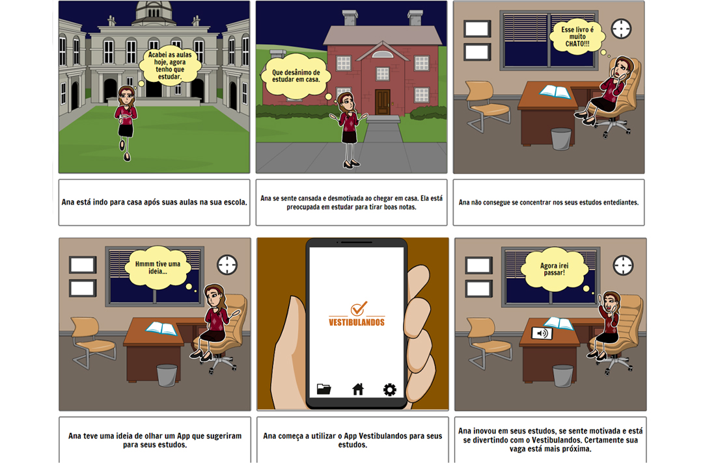

# Storyboads

## Histórico de versão
| Data | Versão | Descrição | Autor(es) |
| :--: | :----: | :-------: | :-------: |
|11/09/2020| 0.1 | Criação do Manual de Identidade Visual| [Guilherme Leal](https://github.com/gleal17)|

# Introdução

Storyboard (também chamados Roteiros) são definidos por Preece et al(1) como sendo a representação de sequências de ações ou eventos pelas quais o usuário e o produto devem passar para executarem uma ação. Preece et al (1) afirmam ainda que há dois propósitos em utilizar-se de Storyboards: (i) para obter feedback de usuários, e (ii) para que a equipe de design considere o cenário e a utilização do produto em maiores detalhes. 

# 2. Storyboards

## 2.1 Storyboard 1

## 2.2 Storyboard 2

## Requisitos Elicitados

| Código | Descrição |
|--------|-----------|
|SB00| O app deve auxiliar os estudos|
|SB01| O usuário deve ser capaz de utilizar o app sem acompanhamento|
|SB02| O app deve animar/estimular o usuário a estudar|
|SB03| O app deve ser acessível por dispositivos móveis |

## Referêcias

>(1) PREECE, J.; Rogers, Y.; Sharp, H. (2013). Design de Interação: além da interação humano-computador. Tradução: Isabela Gasparini; revisão técnica: Marcelo Soares Pimenta - 3. Ed – Porto alegre: Bookman, 2013. 

>Storyboard 1 por Leow Hou Teng (Adaptado). Acessível em 11/09/2020 em:
https://design.leowhouteng.com/portfolio/mobile-studies-learning-management-system/design-portfolio-leow-hou-teng-mobile-studies-learning-management-system-storyboard-scenario-academically-weak-student/

>Storyboard 2 por Guilherme Leal (edição adaptada) em https://www.storyboardthat.com/