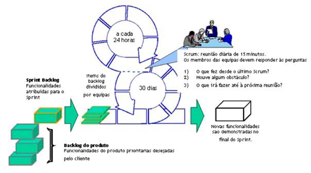
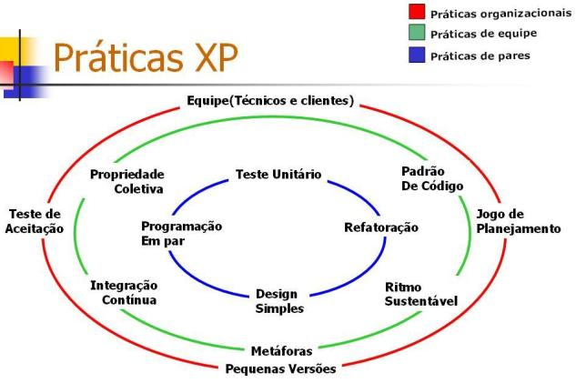
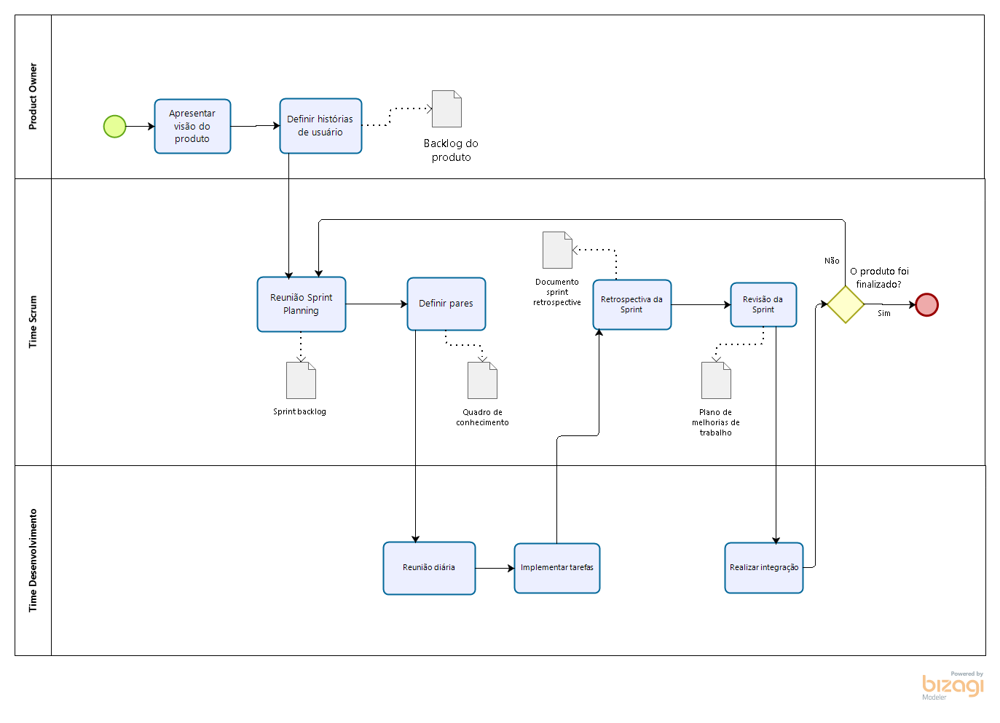

# METODOLOGIAS

## Histórico de Versões

|   Data   | Versão |           Descrição           |             Autor(es)              |
|:--------:|:------:|:-----------------------------:|:----------------------------------:|
| 11/09/2020 | 0.1 | Adicionado o documento | Julio Litwin |

### Introdução

Trata-se de especificar as metologias nas quais serão utilizadas ao projeto do Vestibulandos, estaremos trabalhando de forma híbrida, usando o Scrum e o XP.

### Scrum

O Scrum é uma metodologia ágil de trabalho onde é usada para estabelecer conjuntos de regras e práticas de gestão para conseguir o sucesso de um projeto. Com o foco no trabalho em equipe, ocorre uma melhora na comunicação e maximiza o apoio de todos, fazendo com que todos do time se esforcem e se sintam bem com que estão fazendo e isso acaba gerando mais para frente um aumento de produtividade.

- É um processo ágil para gerenciar e controlar o desenvolvimento de projetos;
- É um wrapper para outras práticas de engenharia de software;
- É um processo que controla o caos resultante de necessidades e interesses conflitantes;
- É uma forma de aumentar a comunicação e maximizar a cooperação;
- É uma forma de detectar e remover qualquer impedimento que atrapalhe o desenvolvimento de um produto;
- É escalável desde projetos pequenos até grandes projetos em toda empresa.

### XP

O XP é uma metodologia ágil de desenvolvimento de softwares focada na agilidade de equipes e na qualidade dos projetos e tem como seus valores a simplicidade, o feedback, a comunicação, a coragem, o respeito.

O XP tem como seus princípios básicos o feedback rápido, a simplicidade, a ideia de abraçar mudanças, fazer um trabalho de qualidade e aceitar mudanças incrementais.

- Programação em par/dupla num único computador. Geralmente a dupla é formada por um iniciante na linguagem e outra pessoa funcionando como um instrutor. 
- Refatoração é um processo que permite a melhoria continua da programação, com o mínimo de introdução de erros e mantendo a compatibilidade com o código já existente. 
- Integração contínua, sempre que produzir uma nova funcionalidade, nunca esperar uma semana para integrar à versão atual do sistema. Isto só aumenta a possibilidade de conflitos e a possibilidade de erros no código fonte. Integrar de forma contínua permite saber o status real da programação.

### Ferramentas a serem utilizadas

| Tipo | Ferramenta | Descrição |
|-----|---------|--------------|
| Comunicação | Microsoft Teams, Discord, Telegram | Ferramentas a serem usado para reuniões e paramentos. |
| Versionamento  |  Github | Onde será publicado todo o escopo do projeto e código fonte |
| Editor | Visual Studio Code, Atom, MEditor | Usado para escrever as documentações, requisitos do projeto |

### BPMN da metodologia

### Referências
**SERRANO, Maurício; SERRANO, Milene. Requisitos - Aula 10. 1º/2019. 35 slides.** Material apresentado para a disciplina de Requisitos de Software no curso de Engenharia de Software da UnB, FGA.

**DevMedia**, Agile Development: XP e Scrum em uma Abordagem Comparativa. Disponível em: <https://www.devmedia.com.br/agile-development-xp-e-scrum-em-uma-abordagem-comparativa/30808.>. Acesso em: 11, Setembro e 2020.
