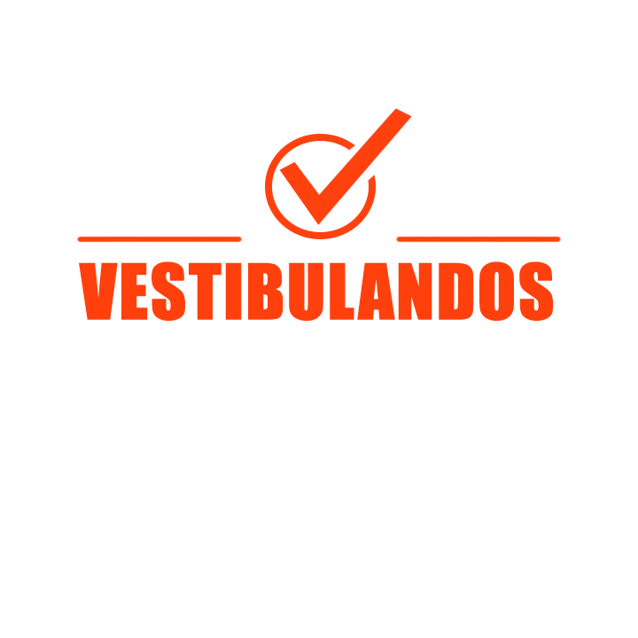
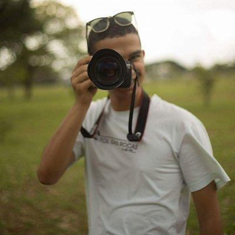

# Sobre

&emsp;&emsp;O Vestibulandos é um jogo de perguntas e respostas com o intuito de tornar divertido a forma como o vestibulando estuda. Há uma interação entre vestibulandos onde podem desafiar entre si para ver quem tem maior domínio em uma ou várias áreas de conhecimento. Proporcionar para os vestibulando uma experiência em treinar para o vestibular de forma fácil, interativa e divertida.

<b>&emsp;&emsp;Desafie-se para os vestibulares do Brasil de uma maneira totalmente nova! Com o Vestibulandos você testa seus conhecimentos, compara seus resultados com outros usuários e aprende brincando. Estudar nunca foi tão divertido!</b>

# Membros

  <table style="width:100%;">
    <tr>
     <td style="text-align:center;">
        
        <figcaption>
            <a href="https://github.com/fernand0aguilar"> Fernando Aguilar </a>
        </figcaption>
    </td>
    <td style="text-align:center;">
        
        <figcaption>
            <a href="https://github.com/gleal17"> Guilherme Leal </a>
        </figcaption>
    </td>
    <td style="text-align:center;">
        
        <figcaption>
            <a href="https://github.com/jpmartins201"> João Pedro </a>
        </figcaption>
    </td>
    </tr>
    <tr>
     <td style="text-align:center;">
        
        <figcaption>
            <a href="https://github.com/juliolitwin"> Julio Litwin </a>
        </figcaption>
    </td>
    <td style="text-align:center;">
        
        <figcaption>
            <a href="https://github.com/lucasgomesgs0"> Lucas Gomes </a>
        </figcaption>
    </td>
    <td style="text-align:center;">
        
        <figcaption>
            <a href="https://github.com/ricardocanela"> Ricardo Lima </a>
        </figcaption>
    </td>
    </tr>
  </table>    

