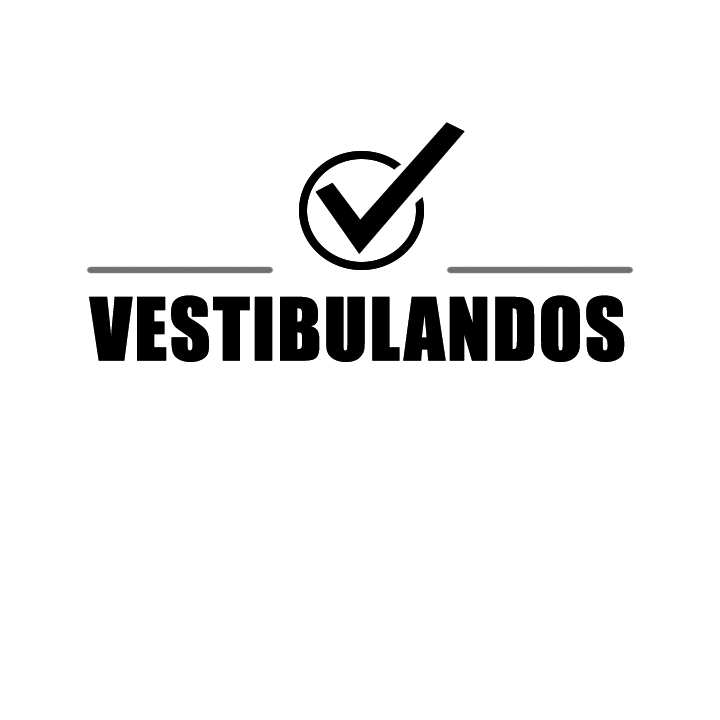

# Identidade Visual

## Histórico de versão
| Data | Versão | Descrição | Autor(es) |
| :--: | :----: | :-------: | :-------: |
|11/09/2020| 0.1 | Criação do Manual de Identidade Visual| [Guilherme Leal](https://github.com/gleal17)|

## Introdução

Uma identidade visual reúne os aspectos que levam a identificar uma empresa ou produto vinculando-os em suas diversas variações. Reúne também as informações visuais como os logotipos, os símbolos, as cores, os tipos, as disposições e os arranjos gráficos que devem sempre se manter padronizados para consolidar a marca e seu produto. 

## 2. Conceito

A logomarca criada para o projeto Vestibulandos tem como principal objetivo fornecer uma representação gráfica para o mesmo, de modo a possibilitar identificação imediata em suas diferentes aplicações. 
Composta pela união de símbolo e tipografia, a identidade visual do projeto utilizou como base referências visuais que remetem ao preenchimento de gabaritos e o resultado positivo. O símbolo foi criado especificamente para refletir a personalidade do projeto. O laranja, cuja tonalidade também foi selecionada especificamente para o projeto, busca trazer espontaneidade, permitindo que os vestibulandos se mantenham motivados durante o aprendizado.

## 3. Logo

## Autor: [Guilherme Leal](https://github.com/gleal17)

### Aplicação Preto e Branco

## 3.1 Paleta de Cores

## Referências
> O Processo de desenvolvimento de uma identidade visual. Felipe Teixeira, Robeto Oliveira e Silva, Rafael Bona. Intercom – Sociedade Brasileira de Estudos Interdisciplinares da Comunicação VIII Congresso Brasileiro de Ciências da Comunicação da Região Sul – Passo Fundo – RS 