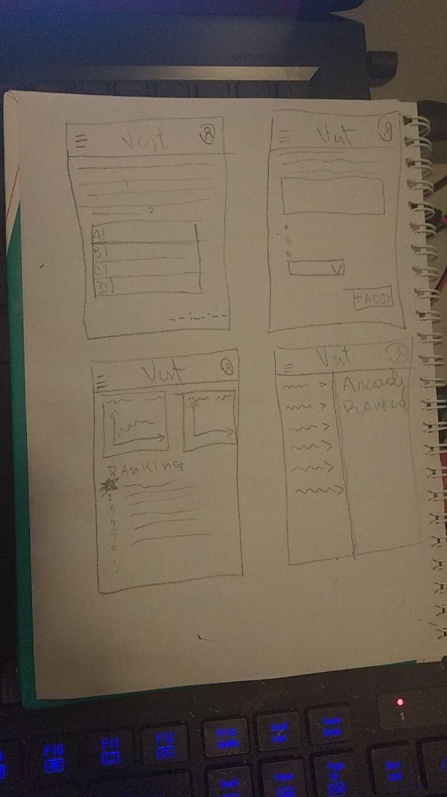
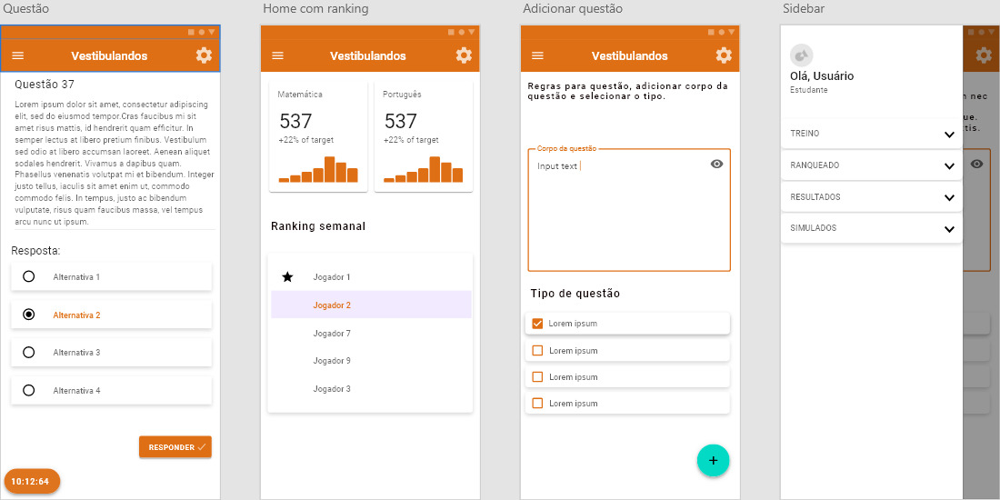

# Protótipos

## Histórico de versão
| Data | Versão | Descrição | Autor(es) |
| :--: | :----: | :-------: | :-------: |
|11/09/2020| 0.1 | Criação de Protótipos de baixa e alta fidelidade| [João Pedro Martis](hhttps://github.com/jpmartins201)|

## Protótipo de Baixa fidelidade

## Protótipo de Alta fidelidade

