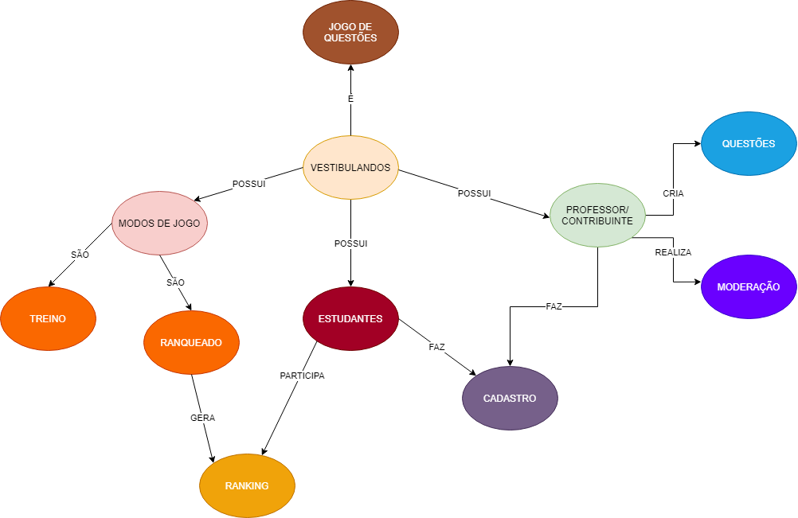
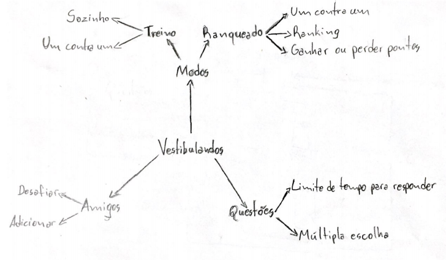

# Brainstorming

## Histórico de versão
| Data | Versão | Descrição | Autor(es) |
| :--: | :----: | :-------: | :-------: |
| 11/09/2020| 0.1 | Criação do documento | Lucas Gomes |
| 11/09/2020| 0.2 | Adição de mapas mentais | Lucas Gomes |

## 1. Introdução
O mapa mental é um diagrama que auxilia na elaboração de idéias a partir de um assunto central. É um diagrama simples onde é possível ser criado a mão livre enquanto participa de alguma reunião ou brainstorming. O mapa mental dá uma visão geral do assunto central e ajuda na memorização das idéias ali representadas, além de facilitar no planejamento.

## 2. Mapas mentais

## Autor: [Guilherme Leal](https://github.com/gleal17)

## Autor: [João Pedro](https://github.com/jpmartins201)

## Autor: [Julio Litwin](https://github.com/juliolitwin)

## Autor: [Lucas Silva](https://github.com/lucasgomesgs0)

## 3. Referências
- Material complementar da disciplina Arquitetura e Desenho de Software. VideoAula 02e - DSW - Base - Mapa Mental. Professora Milene Serrano. Universidade de Brasília.

- What is a Mind Map?. mindmapping, 2020. Disponível em https://www.mindmapping.com/mind-map.php. Acesso em: 11/09/2020.