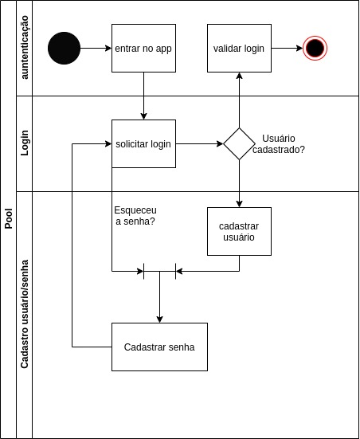
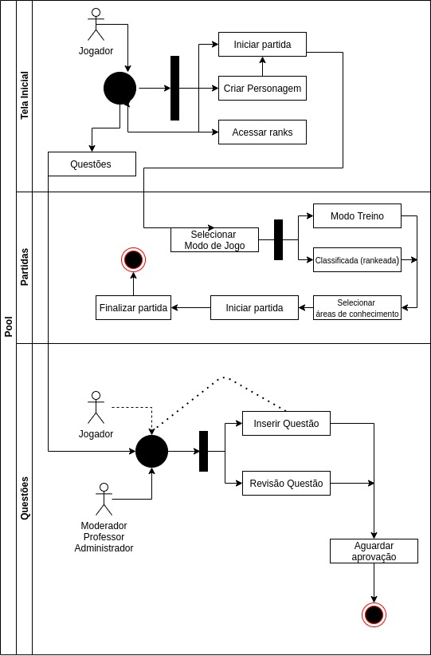

# DIAGRAMA DE ATIVIDADES

## Histórico de Versões

|   Data   | Versão |Descrição| Autor(es)|
|:--------:|:------:|:---------------------:|:--------------:|
|28/09/2020|   0.1 | Adicionado o documento | [Guilherme Leal](https://github.com/gleal17) |

### Introdução

 O diagrama de classe oferece recursos para evidenciar fluxos de ações e seus resultados. O foco é capturar ações de numa instância de um obejto e seus resultados das mudanças de estado.

### Diagrama

#### Versão: 0

### Referências

> Mello, Rafael Maiani de, Técnica para Inspeção de Diagramas de Atividades - Rio de Janeiro: UFRJ/COPPE,2011.

> Diagrama de Autenticação e Diagrama de Atividades por Guilherme Leal em https://app.diagrams.net/