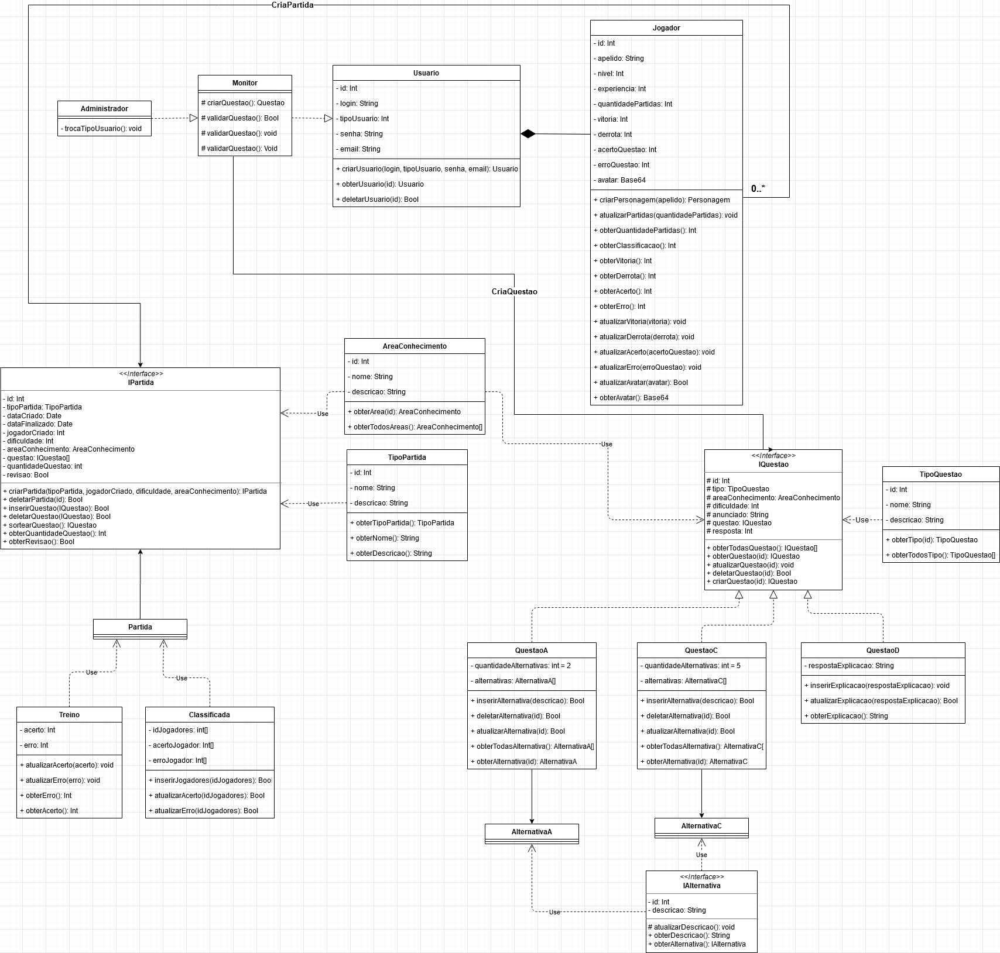

# DIAGRAMA DE CLASSE

## Histórico de Versões

|   Data   | Versão |           Descrição           |             Autor(es)              |
|:--------:|:------:|:-----------------------------:|:----------------------------------:|
| 18/09/2020 | 0.1 | Adicionado o documento | Julio Litwin |

### Introdução
Os diagramas de classes são os principais blocos de construção de todos os métodos orientados a objetos. O diagrama de classes pode ser usado para mostrar as classes, relacionamentos, interface, associação e colaboração. UML é padronizado em diagramas de classes. Como as classes são o bloco de construção de um aplicativo baseado em OOPs, o diagrama de classes tem uma estrutura apropriada para representar as classes, herança, relacionamentos e tudo o que OOPs tem em seu contexto. Ele descreve vários tipos de objetos e a relação estática entre eles.

### Diagrama

#### Versão: 0

### Referências
**GeeksForGeeks**. Disponível em: <https://www.geeksforgeeks.org/unified-modeling-language-uml-class-diagrams/>. Acesso em: 18 de Setembro 2020.
