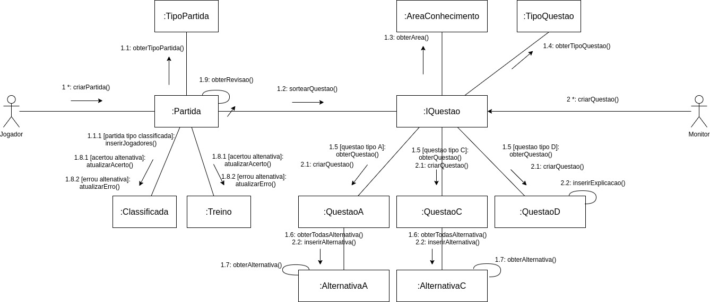

# DIAGRAMA DE COMUNICAÇÃO

## Histórico de Versões

|   Data   | Versão |           Descrição           |             Autor(es)              |
|:--------:|:------:|:-----------------------------:|:----------------------------------:|
| 27/09/2020 | 0.1 | Adicionado o documento | Ricardo Canela |

### Introdução
Os diagramas de comunicação ou de colaboração são de cunho dinâmico que mostra a interação entre objetos do sistema usando mensagens sequenciais, deixando claro a ordem em que as mensagens vão acontecendo. Nesse documento são apresentados os casos de uso pertencentes ao projeto Vestibulandos que são a criação de partida pelo jogador e a criação de questões pelo monitor.

### Diagrama

#### Versão: 0

### Referências
**monitoriadeengenhariadesoftware**. Disponível em: <https://monitoriadeengenhariadesoftware.wordpress.com/2016/03/20/diagrama-de-comunicacao/>. Acesso em: 27 de Setembro 2020.
