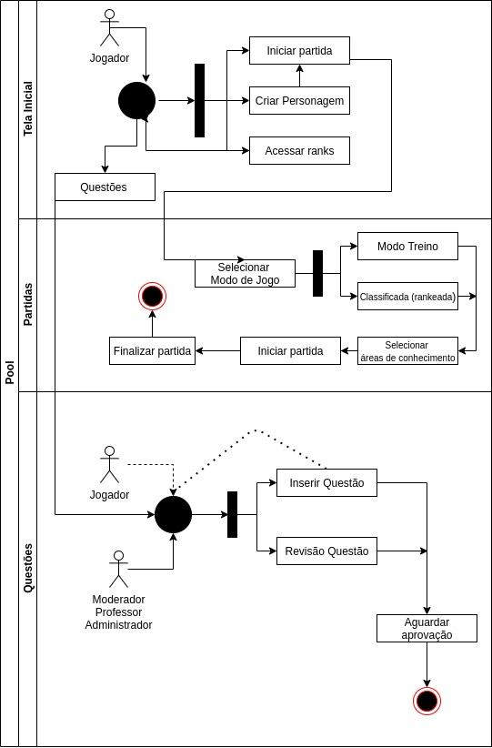

# DIAGRAMA DE ATIVIDADES

## Histórico de Versões

|   Data   | Versão |Descrição| Autor(es)|
|:--------:|:------:|:---------------------:|:--------------:|
|28/09/2020|   0.1 | Adicionado o documento | [Guilherme Leal](https://github.com/gleal17) |
|26/10/2020|   0.1 | Adicionado gateways diagrama de autenticação, correção de notação no diagrama de atividades e rastreabilidade | [Guilherme Leal](https://github.com/gleal17) |

### Introdução

 O diagrama de classe oferece recursos para evidenciar fluxos de ações e seus resultados. O foco é capturar ações de numa instância de um obejto e seus resultados das mudanças de estado.

### Diagrama

#### DIAGRAMA DE AUTENTICAÇÃO - Versão: 0

#### DIAGRAMA DE ATIVIDADES - Versão: 0 

#### DIAGRAMA DE AUTENTICAÇÃO - Versão: 1

#### DIAGRAMA DE ATIVIDADES - Versão: 1

#### Rastreabilidade de Requisitos

| Épico | Requisito | Descrição|
|---|---|---|
|US01 | RF01|Login|
| US10-14 | RF09, RF10, RF11 |Iniciar Partida|
| US02 | RF01   |Criar Personagem|
|  US18, US22| RF16, RF21   |Acessar Ranks|

### Referências

> Mello, Rafael Maiani de, Técnica para Inspeção de Diagramas de Atividades - Rio de Janeiro: UFRJ/COPPE,2011.

> Diagrama de Autenticação e Diagrama de Atividades por Guilherme Leal em https://app.diagrams.net/