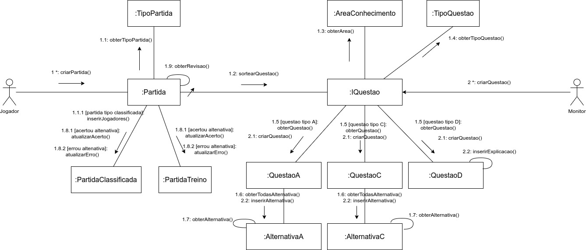

# DIAGRAMA DE COMUNICAÇÃO

## Histórico de Versões

|   Data   | Versão |           Descrição           |             Autor(es)              |
|:--------:|:------:|:-----------------------------:|:----------------------------------:|
| 27/09/2020 | 0.1 | Adicionado o documento | Ricardo Canela |
|26/10/2020|   0.1 | Adicionado  correção de notação no diagrama de comunicação e rastreabilidade | [Guilherme Leal](https://github.com/gleal17) |

## Introdução

Os diagramas de comunicação ou de colaboração são de cunho dinâmico que mostra a interação entre objetos do sistema usando mensagens sequenciais, deixando claro a ordem em que as mensagens vão acontecendo. Nesse documento são apresentados os casos de uso pertencentes ao projeto Vestibulandos que são a criação de partida pelo jogador e a criação de questões pelo monitor.

### Diagrama

#### Versão: 0

#### Versão: 1

## Rastreabilidade de Requisitos
| Épico | Requisito | Descrição|
|---|---|---|
| US04, US10, US11, US12, US19 | RF03, RF08, RF10, RF17 | Partida Treino|
| US04| RF16| Partida Rankeada|
| US07| RF05| Área de conhecimento|
| US05, US06, US07, US08, US15 | RF, 04RF05,RF06,RF10,RF13, RF19| Questão|

## Referências
**monitoriadeengenhariadesoftware**. Disponível em: <https://monitoriadeengenhariadesoftware.wordpress.com/2016/03/20/diagrama-de-comunicacao/>. Acesso em: 27 de Setembro 2020.
