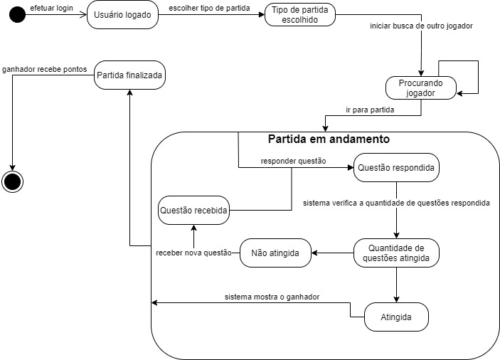
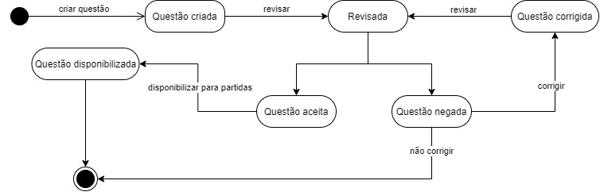

# Diagrama de Estados

## Histórico de Versões

|   Data   | Versão |           Descrição           |             Autor(es)              |
|:--------:|:------:|:-----------------------------:|:----------------------------------:|
| 24/09/2020 | 0.1 | Criado o documento | Lucas Gomes |
| 24/09/2020 | 0.2 | Adicionou os diagramas | Lucas Gomes |
| 19/11/2020 | 0.3 | Inserindo rastreabilidade de requisitos e decisão da equipe | Ricardo Canela e Joao Pedro |

## 1. Introdução
O Diagrama de Estados é um tipo de diagrama comportamental que mostra transições entre diversos estados e facilita a visualização dos possíveis estados que um objeto pode atingir. Cada diagrama de estados começa de um estado inicial, passa por vários estados possíveis e termina em um estado final, onde cada estado é atingível por um determinado evento.

## 2. Diagramas

### 2.1 Diagrama de Estados - Partida

#### Versão 0 - Autor: [Lucas Gomes](https://github.com/lucasgomesgs0)

### 2.2 Diagrama de Estados - Questão

#### Versão 0 - Autor: [Lucas Gomes](https://github.com/lucasgomesgs0)

### Rastreabilidade de Requisitos

|Épico|Requisito| Descrição |
|-------|-----|------|
| US05, US06 | RF04, RF19 | Usuário|
| US04| RF03, RF08 | Partida|
| US07, US12|RF05,  RF 10| Jogador|
| US04, US10, US11, US12, US19 | RF03, RF08, RF10, RF17 | Partida Treino|
| US04| RF16| Partida Rankeada|
| US05, US06, US07, US08, US15 | RF, 04RF05,RF06,RF10,RF13, RF19| Questão|

### Rastreabilidade de decisão da equipe

[Ata 6](../reunioes/ata_6.md)

## 3. Referências
- BLAHA, Michael; RUMBAUGH, James. Modelagem e projetos baseados em objetos com UML 2. 2. ed. rev. [S. l.]: Elsevier, 2006. cap. 5, p. 93-109.

- Material complementar da disciplina Arquitetura e Desenho de Software. VideoAula 06d - DSW - Modelagem - Diagrama de Estados. Professora Milene Serrano. Universidade de Brasília.

- Lucidchart. O que é um diagrama de máquina de estados?. Disponível em: <https://www.lucidchart.com/pages/pt/o-que-e-diagrama-de-maquina-de-estados-uml>. Último acesso em: 24/09/2020.