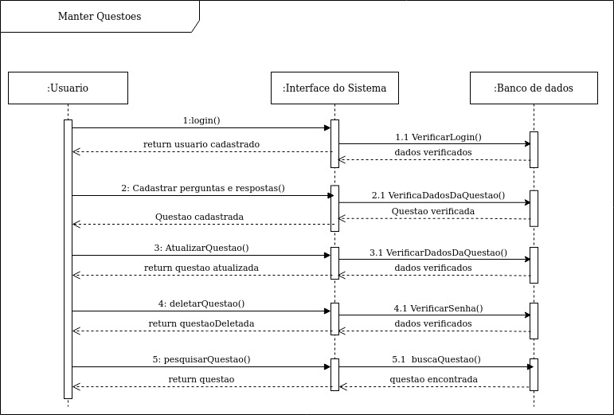
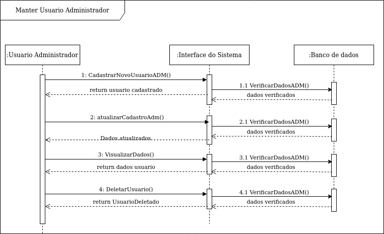
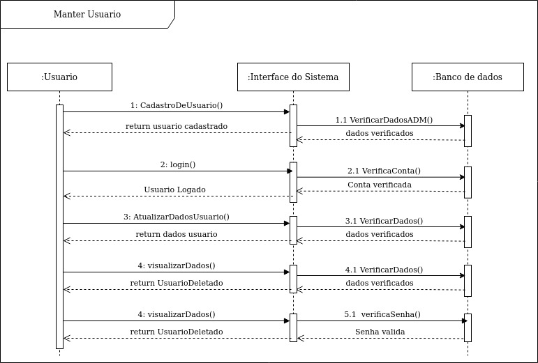

# DIAGRAMA DE COMUNICAÇÃO

## Histórico de Versões

|   Data   | Versão |           Descrição           |             Autor(es)              |
|:--------:|:------:|:-----------------------------:|:----------------------------------:|
| 28/09/2020 | 0.1 | Adicionado o documento | Fernando Aguilar |
| 19/11/2020 | 0.2 | Inserindo rastreabilidade de requisitos e decisão da equipe | Ricardo Canela e Joao Pedro |

### Introdução

Os diagramas de Sequencia representam a sequência de processos num programa de computador. Como um projeto pode ter uma grande quantidade de métodos em classes diferentes, pode ser difícil determinar a sequência global do comportamento.. Nesse documento são apresentados as sequencias pertencentes ao projeto Vestibulandos.

### Diagramas

#### Versão: 0

**Manter Questoes**

**Manter Usuario**

**Manter Usuario Admin**

### Rastreabilidade de Requisitos

|Épico|Requisito| Descrição |
|-------|-----|------|
| US05, US06 | RF04, RF19 | Usuário|
| US01, US02 | RF01| Autenticação|
| US07, US12|RF05,  RF 10| Jogador|
| US16 | RF14 | Informação sobre jogares|
| US05, US06, US07, US08, US15 | RF, 04RF05,RF06,RF10,RF13, RF19| Questão|

### Rastreabilidade de decisão da equipe

[Ata 6](../reunioes/ata_6.md)

### Referências
**LucidChart**. Disponível em: <https://www.lucidchart.com/pages/pt/o-que-e-diagrama-de-sequencia-uml>. Acesso em: 28 de Setembro 2020.
