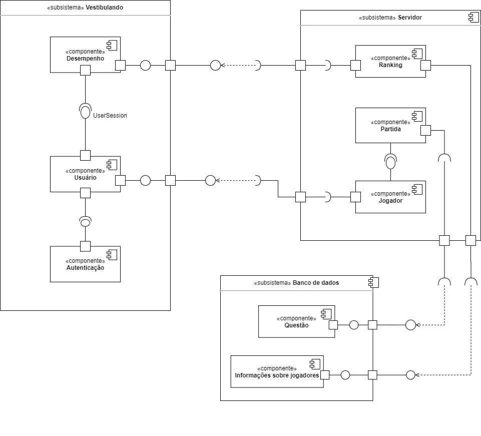

# Diagrama de Estados

## Histórico de Versões

|   Data   | Versão |           Descrição           |             Autor(es)              |
|:--------:|:------:|:-----------------------------:|:----------------------------------:|
| 28/09/2020 | 0.1 | Criado o documento | Lucas Gomes |
| 28/09/2020 | 0.2 | Adicionou diagrama de componentes versão 0 | Lucas Gomes |

## 1. Introdução

## 2 Diagrama de Componentes

#### Versão 0 - Autor: [Lucas Gomes](https://github.com/lucasgomesgs0)

## 3. Referências
- Lucidchart. Diagrama de componentes UML: o que é, como fazer e exemplos. Disponível em: <https://www.lucidchart.com/pages/pt/diagrama-de-componentes-uml>. Último acesso em: 28/09/2020.

- SIRTOLI, Paulo Ricco. Diagramas Estruturais da UML: Diagramas de Componentes. Disponível em: <http://micreiros.com/diagramas-de-componentes/>. Último acesso em: 28/09/2020.