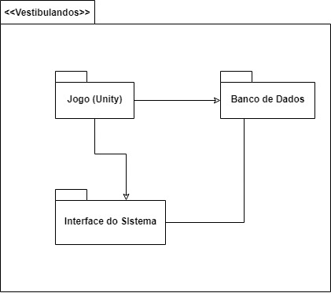
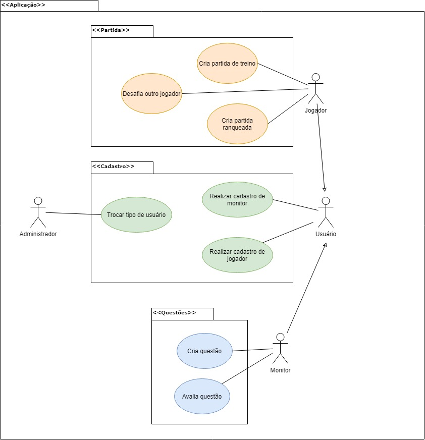

# Diagrama de Pacotes

## Histórico de Versões

|   Data   | Versão |           Descrição           |             Autor(es)              |
|:--------:|:------:|:-----------------------------:|:----------------------------------:|
| 28/09/2020 | 0.1 | Adicionado o documento | João Pedro |
| 28/09/2020 | 0.2 | Adicionado nova versão do diagrama de pacote | Julio Litwin |
| 19/11/2020 | 0.3 | Inserindo rastreabilidade de requisitos e decisão da equipe | Ricardo Canela e Joao Pedro |

## 1. Introdução
Diagramas de pacotes são diagramas estruturais usados para mostrar, em uma forma de pacotes, a organização e disposição de vários elementos de modelos. Um pacote é um agrupamento de elementos UML relacionados, como diagramas, documentos, classes ou até mesmo outros pacotes. Cada elemento é colocado dentro do pacote e é representado como uma pasta de arquivo dentro do diagrama, e depois organizado hierarquicamente no diagrama. Diagramas de pacotes são bastante usados para proporcionar uma organização visual de uma arquitetura em camadas de qualquer classificador UML, por exemplo, um sistema de software.

## 2. Diagramas - v0

### 2.1 Diagrama de Pacotes
#### Versão 0 - Autor: [João Pedro](https://github.com/jpmartins201)

### 2.2 Diagrama de Pacotes - Casos de uso
#### Versão 0 - Autor: [João Pedro](https://github.com/jpmartins201)

## 2. Diagramas - v1

### 2.1 Diagrama de Pacotes
#### Versão 1 - Autor: [Julio Litwin](https://github.com/juliolitwin)

### Rastreabilidade de Requisitos

|Épico|Requisito| Descrição |
|-------|-----|------|
| US05, US06 | RF04, RF19 | Usuário|
| US01, US02 | RF01| Autenticação|
| US18, US22| RF16,RF21 |Ranking|
| US04| RF03, RF08 | Partida|
| US07, US12|RF05,  RF 10| Jogador|
| US16 | RF14 | Informação sobre jogares|
| US04, US10, US11, US12, US19 | RF03, RF08, RF10, RF17 | Partida Treino|
| US04| RF16| Partida Rankeada|
| US07| RF05| Área de conhecimento|
| US05, US06, US07, US08, US15 | RF, 04RF05,RF06,RF10,RF13, RF19| Questão|

### Rastreabilidade de decisão da equipe

[Ata 6](../reunioes/ata_6.md)

### Referências
**Lucidchart**, Tudo sobre diagramas de pacotes UML. Disponível em: https://www.lucidchart.com/pages/pt/diagrama-de-pacotes-uml. Acesso em: 28/09/2020.

