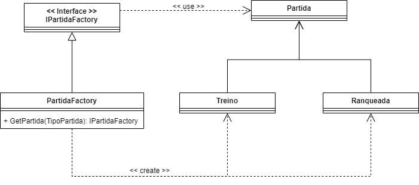
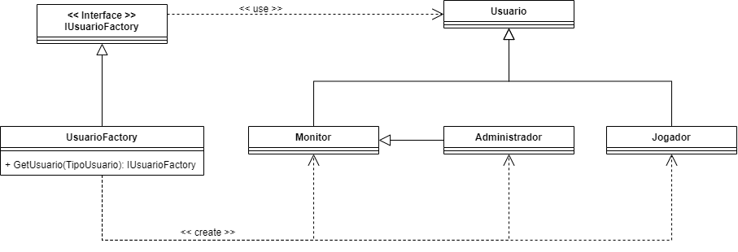

# GOF's Criacionais

## Histórico de Versões

|   Data   | Versão |           Descrição           |             Autor(es)              |
|:--------:|:------:|:-----------------------------:|:----------------------------------:|
| 24/10/2020 | 0.1 | Adicionado o documento | Julio Litwin |
| 25/10/2020 | 0.2 | Adicionado Factory Method de Partida | Lucas Gomes, Julio Litwin |
| 25/10/2020 | 0.3 | Correção da seta de Treino e Raqueada no diagrama | Lucas Gomes |
| 25/10/2020 | 0.4 | Adicionado Factory Method de Usuário | Lucas Gomes, Julio Litwin |

## Introdução

Padrões de Criação se preocupam com a maneira como os objetos são criados. Eles reduzem as complexidades e a instabilidade criando objetos de maneira controlada.

O novo operador é frequentemente considerado prejudicial, pois espalha objetos por todo o aplicativo. Com o tempo, pode se tornar um desafio alterar uma implementação porque as classes se tornam fortemente acopladas.

Os Padrões de Criação tratam desse problema separando inteiramente o cliente do processo de inicialização real.

Fazendo um paralelo com o mundo real, uma empresa automobilística quando precisa de amortecedores, ela terceiriza (solicita-os) e então os instala em seus carros, sem se preocupar com o todo envolvido na criação desse componente.

## Factory Method
É um padrão criacional que permite a superclasse "adiar" a criação de objetos para suas subclasses assim dando a possibilidade das subclasses alterar o tipo de objeto que será criado. Isso é feito instanciando um objeto da superclasse e chamando o método que retorna um objeto de determinada classe solicitada no parâmetro do método. 

Foi utilizado esse método pela facilidade de criação de novas subclasses sem quebrar o código já em produção além de facilitar a manutenção do código já que cada classe tem responsabilidades únicas.

### Factory method para Partida
#### Diagrama representando o padrão no projeto
- Versão 0

> [Implementação em código - Versão 0](./factory_partida_codigo_v0.md)

### Factory method para Usuário
#### Diagrama representando o padrão no projeto
- Versão 0

> [Implementação em código - Versão 0](./factory_usuario_codigo_v0.md)

## Referências

- **Baeldung**, Introduction to Creational Design Patterns. Disponível em: <https://www.baeldung.com/creational-design-patterns>. Acesso em: 24 de Outubro 2020.

- **REFACTORING . GURU**, reational Design Patterns. Disponível em: <https://refactoring.guru/design-patterns/creational-patterns>. Acesso em: 24 de Outubro 2020.

- **TreinaWeb**, Padrões de projeto: o que são e o que resolvem. Disponível em: <https://www.treinaweb.com.br/blog/padroes-de-projeto-o-que-sao-e-o-que-resolvem/>. Acesso em: 24 de Outubro 2020.

- **Wikipedia**, Padrão de projeto de software. Disponível em: <https://pt.wikipedia.org/wiki/Padr%C3%A3o_de_projeto_de_software>. Acesso em: 24 de Outubro 2020.

- Material complementar da disciplina Arquitetura e Desenho de Software. VideoAula 08a - Vídeo-Aula - DSW - GoFs - Criacionais. Professora Milene Serrano. Universidade de Brasília.