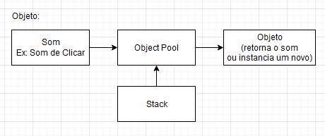
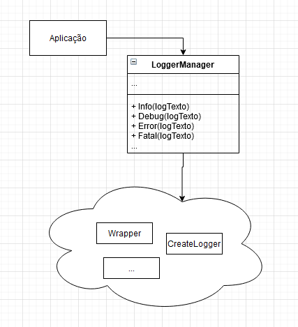
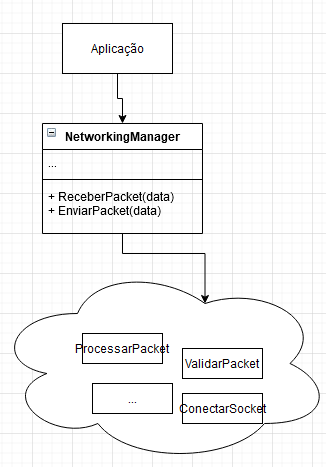

# GOF's Estruturais

## Histórico de Versões

|   Data   | Versão |           Descrição           |             Autor(es)              |
|:--------:|:------:|:-----------------------------:|:----------------------------------:|
| 24/10/2020 | 0.1 | Adicionado o documento | Julio Litwin |
| 26/10/2020 | 0.2 | Adicionado o padrão Flyweight | Julio Litwin |
| 26/10/2020 | 0.3 | Adicionado o padrão Flyweight do som | Julio Litwin |
| 26/10/2020 | 0.4 | Adicionado o padrão Facade | Guilherme Leal |
| 26/10/2020 | 0.5 | Complementado o padrão Facade | Guilherme Leal |

## Introdução

Os Padrões Estruturais lidam com a composição de classes e objetos. Eles fornecem maneiras diferentes de usar composição e herança de objetos para criar alguma abstração.

## Flyweight
O Flyweight é um padrão de projeto estrutural que permite a você colocar mais objetos na quantidade de RAM disponível ao compartilhar partes comuns de estado entre os múltiplos objetos ao invés de manter todos os dados em cada objeto.

### Prós
- Você pode economizar muita RAM, desde que seu programa tenha muitos objetos similares.

### Contras
- Você pode estar trocando RAM por ciclos de CPU quando parte dos dados de contexto precisa ser recalculado cada vez que alguém chama um método flyweight.
- O código fica muito mais complicado. Novos membros de equipe sempre se perguntarão por que o estado de uma entidade foi separado de tal forma.

### Aplicabilidade
Será utlizado um "Object Pool" na parte do Front, na qual tais como na estrutura de UI, como reaproveitar um botão e apenas trocar o texto. Também será usado na questão de sons, na qual ao invés de instanciar toda vez o som, será usado a partir do Object Pool, toda vez que for ser utilizado.

Na linguagem net core, o object pool é muito útil por conta do Garbage Collection, é reduzido drasticamente as inicializações e destruições de objetos, pois estão sendo reutilizados ao invés de instanciando. 

#### Diagrama

##### Diagrama de UI: Botão


##### Diagrama do Som


#### Código

**Observação**: MonoBehaviour é uma classe da própria Unity 3D.

```
public class ObjectPool : MonoBehaviour
{
    public GameObject Prefab;
    public int InitialSize;

    private readonly Stack<GameObject> instances = new Stack<GameObject>();

    private void Awake()
    {
        Assert.IsNotNull(Prefab);
    }

    private void Start()
    {
        for (var i = 0; i < InitialSize; i++)
        {
            var obj = CreateInstance();
            obj.SetActive(false);
            instances.Push(obj);
        }
    }

    public GameObject GetObject()
    {
        var obj = instances.Count > 0 ? instances.Pop() : CreateInstance();
        obj.SetActive(true);
        return obj;
    }

    public void ReturnObject(GameObject obj)
    {
        var pooledObject = obj.GetComponent<PooledObject>();
        Assert.IsNotNull(pooledObject);
        Assert.IsTrue(pooledObject.Pool == this);

        obj.SetActive(false);
        instances.Push(obj);
    }

    public void Reset()
    {
        var objectsToReturn = new List<GameObject>();
        foreach (var instance in transform.GetComponentsInChildren<PooledObject>())
        {
            if (instance.gameObject.activeSelf)
            {
                objectsToReturn.Add(instance.gameObject);
            }
        }
        foreach (var instance in objectsToReturn)
        {
            ReturnObject(instance);
        }
    }

    private GameObject CreateInstance()
    {
        var obj = Instantiate(Prefab);
        var pooledObject = obj.AddComponent<PooledObject>();
        pooledObject.Pool = this;
        obj.transform.SetParent(transform);
        return obj;
    }
}
```

O objeto na qual será reutilizado, é definido em **Prefab**. Sempre que for necessário obter o objeto, é chamado o **GetObject()**, na qual irá verificar se há disponibilidade de objeto, caso não, irá instanciar um novo objeto para ser utilizado e adicionado numa stack.


##  Facade
O Facade é um padrão de projeto estrutural que fornece uma interface simplificada para uma biblioteca, um framework, ou qualquer conjunto complexo de classes.

Uma fachada é uma classe que fornece uma interface simples para um subsistema complexo que contém muitas partes que se movem. Uma fachada pode fornecer funcionalidades limitadas em comparação com trabalhar com os subsistemas diretamente. Contudo, ela inclui apenas aquelas funcionalidades que o cliente se importa.

Ter uma fachada é útil quando você precisa integrar sua aplicação com uma biblioteca sofisticada que tem dúzias de funcionalidades, mas você precisa de apenas um pouquinho delas.

### Prós
- Você pode isolar seu código da complexidade de um subsistema.

### Contras
- Uma fachada pode se tornar um objeto deus acoplado a todas as classes de uma aplicação.

### Aplicabilidade

O Facade será utilizado como no Logger e na parte de Network, também é pensando pelo o MonoBehaviour da própria Unity 3D. Toda a estrutura e lógica serão feito por separados e apenas fornecido como públicos apenas as funções que realmente serão usadas pelo o usuário (desenvolvedor).

No Logger, é utilizado é pensado na questão de ter uma biblioteca relacionado ao Logger, sendo também apto para serem utilizado outros loggers sem ser necessário reescrever toda a estrutura, mas apenas fazendo um wrapper dos logs.

### Diagrama
#### Logger


#### Networking



### Código

Pode se encontrar em LoggerManager.cs.

> [Implementação em código - Versão 0](https://github.com/UnBArqDsw/2020.1_G4_Vestibulandos_Backend/blob/master/GameServer/Logging/LoggerManager.cs./codigos/mediator_partida_codigo_v0.md)

O NetworkManager ainda não foi implementado no código.

## Relação com Flyweight

O Flyweight mostra como fazer vários pequenos objetos, enquanto o Facade mostra como fazer um único objeto que represente um subsistema inteiro.

### Prós

Você pode isolar seu código da complexidade de um subsistema.

### Contras

Uma fachada pode se tornar um objeto global acoplado a todas as classes de uma aplicação.

### Aplicabilidade

**Observação**: A classe MonoBehaviour ja descrita no Padrão Flyweight como uma classe da própria Unity 3D fornece um atalho para as funcionalidades usadas do subsistema

### Referências

- **Baeldung**, Proxy, Decorator, Adapter and Bridge Patterns. Disponível em: <https://www.baeldung.com/java-structural-design-patterns>. Acesso em: 24 de Setembro 2020.

- **REFACTORING . GURU**, Structural Design Patterns. Disponível em: <https://refactoring.guru/design-patterns/structural-patterns>. Acesso em: 24 de Setembro 2020.

- **REFACTORING . GURU**, Structural Design Patterns. Disponível em: <https://refactoring.guru/pt-br/design-patterns/facade>. Acesso em: 24 de Setembro 2020.

- **TreinaWeb**, Padrões de projeto: o que são e o que resolvem. Disponível em: <https://www.treinaweb.com.br/blog/padroes-de-projeto-o-que-sao-e-o-que-resolvem/>. Acesso em: 24 de Setembro 2020.

- **Wikipedia**, Padrão de projeto de software. Disponível em: <https://pt.wikipedia.org/wiki/Padr%C3%A3o_de_projeto_de_software>. Acesso em: 24 de Setembro 2020.

- **Unity 3D**, Object Pooling. Disponível em: <https://unity3d.com/learn/tutorials/topics/scripting/object-pooling>. Acesso em: 26 de Setembro 2020.