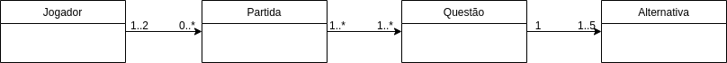
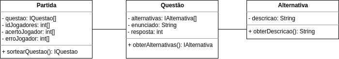
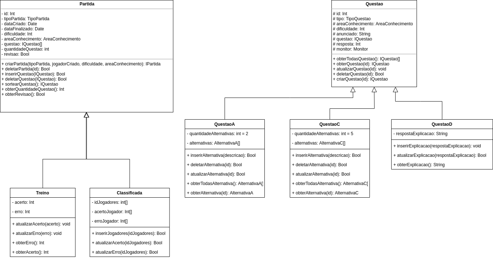
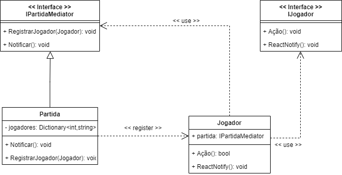
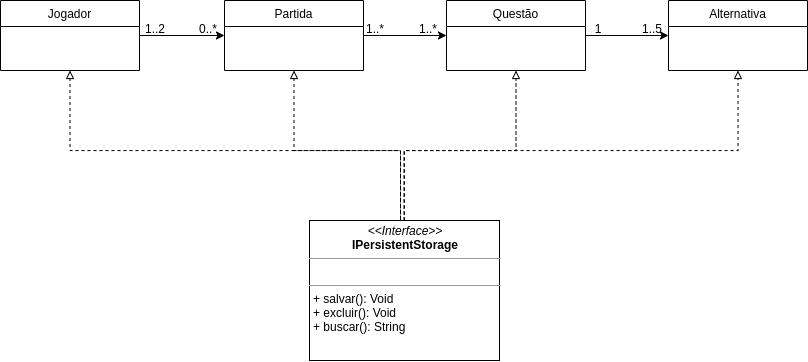

# Padrões GRASP's

## Histórico de Versões

|   Data   | Versão |           Descrição           |             Autor(es)              |
|:--------:|:------:|:-----------------------------:|:----------------------------------:|
| 26/10/2020 | 0.1 | Adicionado o documento | Ricardo Lima Canela |
| 26/10/2020 | 0.2 | Adicionado Criador | Ricardo Lima Canela e Julio Litwin |
| 26/10/2020 | 0.3 | Adicionado Especialista | Ricardo Lima Canela |
| 26/10/2020 | 0.4 | Adicionado Alta Coesão e Baixo Acoplamento | Ricardo Lima Canela |
| 26/10/2020 | 0.5 | Adicionado Polimorfismo | Ricardo Lima Canela e Julio Litwin |
| 26/10/2020 | 0.6 | Adicionado Controlador | Ricardo Lima Canela e Julio Litwin |
| 26/10/2020 | 0.7 | Adicionado Fabricacao | Ricardo Lima Canela |
| 26/10/2020 | 0.8 | Corrigindo Indireção | Ricardo Lima Canela |
| 26/10/2020 | 0.9 | Adicionando Exemplos em Código | Ricardo Lima Canela |
| 26/10/2020 | 0.9.1 | Refatorando especialista | João Pedro Martins |

### Introdução

Para explicar o que são os Padrões GRASPs vamos primeiro entender o que são Padrões de Projeto. No contexto de desenvolvimento de software, é comum nos depararmos com problemas que já foram enfrentados por outros programadores anteriormente e que geraram soluções validadas, funcionais e que se tornaram padrões para desenvolvimento.

Os Padrões GRASP's (General Responsibility Assignment Software Patterns) consistem em uma série de princípios, práticas e soluções baseados em conceitos para atribuição de responsabilidades a classes e objetos na construção de softwares usando programação orientada a objetos.

Para realizar a proposta dos Padrões GRASP's de correta atribuição de responsabilidades, foram divididos padrões que solucionam problemas e aumentam a qualidade e a manutenibilidade do código. A seguir será apresentado a explicação de cada um e a utilização no projeto Vestibulandos.

### Criador

Problema: Quem deve ser responsável por criar uma nova instância de uma classe?
Solução: Atribua à classe B a responsabilidade de criar uma instância de A se pelo menos um desses for verdadeiro (quanto mais melhor):  
• B contém ou agrega A  
• B registra a existência de A  
• B usa A  
• B tem os dados necessários para a inicialização de A que serão passados ao construtor de A  

No projeto Vestibulando podemos destacar:  

- Jogador(TODO) é responsável pela criação das Partidas(PARTES)    
- Partida(TODO) é responsável pela criação das Questões(PARTES)  
- Questão(TODO) é responsável pela criação das Alternativa(PARTES)  

#### Detalhamento do Padrão no nível de Modelagem

#### Detalhamento do Padrão no nível de Implementação
[Jogador criando Partida](https://github.com/UnBArqDsw/2020.1_G4_Vestibulandos_Backend/blob/develop/GameServer/Entities/Jogador.cs)

### Especialista

Problema: durante a definição das interações entre os objetos, é preciso fazer escolhas sobre a atribuição de responsabilidades a classes. 
Solução: atribuir uma responsabilidade ao especialista de informação: classe que possui a informação necessária para cumprí-la. 

A diferença entre criador e especialista é que o especialista não só é o melhor para criar a instância do objeto da outra classe como também é o melhor em desempenhar uma função específica do sistema (Quem é a melhor entidade para calcular algo? Quem é a melhor entidade para ordenar algo? Quem é a melhor entidade para cadastrar algo?)

Por isso, a relação das entidades Partida, Questão e Alternativa é dada como especialistas pois cada uma desempenha uma função específica no sistema. Partida é especialista em gerenciar os dados de pontuação. Questão gerencia as informações relacionadas a pergunta a ser respondida. Alternativa da a descrição de cada alternativa. Cada um tem sua responsabilidade. Seria possível porém menos elegante se partida gerenciasse sozinha as questões e as alternativas.

#### Detalhamento do Padrão no nível de Modelagem

#### Detalhamento do Padrão no nível de Implementação
[Questão com anunciado e Lista de Alternativas](https://github.com/UnBArqDsw/2020.1_G4_Vestibulandos_Frontend/blob/dev/Vestibulandos/Assets/Scripts/Quest%C3%A3o/Quest%C3%A3oC.cs)

### Alta Coesão

Alta coesão é atribuir de forma coerente as responsabilidades da classe. Existe uma alta coesão para as classes Partida, Questão e Alternativa já que cada uma tem sua responsabilidade bem definida conforme evidenciado na explicação do GRASP Especialista, que ao ser implementado garantiu ao sistema uma alta coesão nas classes citadas. Nesse caso, os GRASPs Especialista e Alta Coesão foram satisfeitos ao declarar responsabilidades específicas para cada uma das classes citadas (Partida, Questão e Alternativa).

O detalhamento a nível de Modelagem e de Implementação são os mesmos do Padrão Especialista

### Baixo Acoplamento

O Baixo Acoplamento se dá quando uma classe está coesa e possui baixa conexão ou dependência com outras classes. Um caso de alto acoplamento seria fazer com que Partida tivesse que interagir com Questão e Alternativa. Para manter um baixo acoplamento, Partida conversa apenas com Questão, que por sua vez conversa com Alternativa. Baixo Acoplamento anda de mãos dadas com Alta Coesão.

O detalhamento a nível de Modelagem e de Implementação são os mesmos do Padrão Especialista

### Polimorfismo

Polimorfismo diz que as responsabilidades devem ser atribuídas a abstrações e não a objetos concretos, permitindo que eles possam variar conforme a necessidade.
Possuimos as interfaces Partida e Questão que conferem polimorfismo, gerando classes com mesmos métodos e diferentes comportamentos. 
As classes derivadas de Partida são Treino e Classificada e de Questão são QuestãoA, QuestãoB, QuestãoC. 

#### Detalhamento do Padrão no nível de Modelagem

#### Detalhamento do Padrão no nível de Implementação
[QuestaoC implementando IQuestao](https://github.com/UnBArqDsw/2020.1_G4_Vestibulandos_Frontend/blob/dev/Vestibulandos/Assets/Scripts/Quest%C3%A3o/Quest%C3%A3oC.cs)

### Indireção

O objeto intermediário cria uma camada de indireção entre os dois componentes que não mais dependem um do outro: ambos dependem da indireção
Foi realizado a implementação do Padrão de Projeto GoF Mediator. Essa decisão garantiu ao sistema um GRASP Indireção, que gerencia a interação entre Jogadores e Partida.

#### Detalhamento do Padrão no nível de Modelagem

#### Detalhamento do Padrão no nível de Implementação
[Implementação do Mediator](https://github.com/UnBArqDsw/2020.1_G4_Vestibulandos_Backend/blob/develop/GameServer/Interfaces/IPartidaMediator.cs)

### Fabricação ou Invenção Pura

É uma classe que não representa nenhum conceito no domínio do problema, ela apenas funciona como uma classe prestadora de serviços, e é projetada para que possamos ter um baixo acoplamento e alta coesão no sistema.
O backend necessita realizar a persistência dos dados em um Banco de Dados. Para isso será desenvolvido uma classe PersistentStorage para que não necessite que cada classe tenha em si o método de interagir com o Banco de Dados.

Exemplo: Salvar um objeto no Banco de Dados implica em uma série de operações não relacionadas ao conceito de Partida. A classe Partida tem de ser associada à interface do banco de dados relacional.
Várias outras classes no projeto também terão de salvar dados como Questões e Alternativas. Todas irão utilizar a classe PersistentStorage para isso.

#### Detalhamento do Padrão no nível de Modelagem

#### Detalhamento do Padrão no nível de Implementação
Banco de Dados ainda não implementado.

### Referências

- **Medium**, Padrões GRASP — Padrões de Atribuir Responsabilidades. Disponível em: <https://medium.com/@leandrovboas/padr%C3%B5es-grasp-padr%C3%B5es-de-atribuir-responsabilidades-1ae4351eb204>. Acesso em: 26 de Outubro 2020.

- **Facom**, Padrões GRASP. Disponível em: <http://www.facom.ufu.br/~bacala/ESOF/05a-Padr%C3%B5es%20GRASP.pdf>. Acesso em: 26 de Outubro 2020.

- **Wikipedia**, GRASP (padrão orientado a objetos). Disponível em: <https://pt.wikipedia.org/wiki/GRASP_(padr%C3%A3o_orientado_a_objetos)#:~:text=Os%20diferentes%20padr%C3%B5es%20e%20princ%C3%ADpios,protected%20variations%20(varia%C3%A7%C3%B5es%20protegidas).>. Acesso em: 26 de Outubro 2020.
