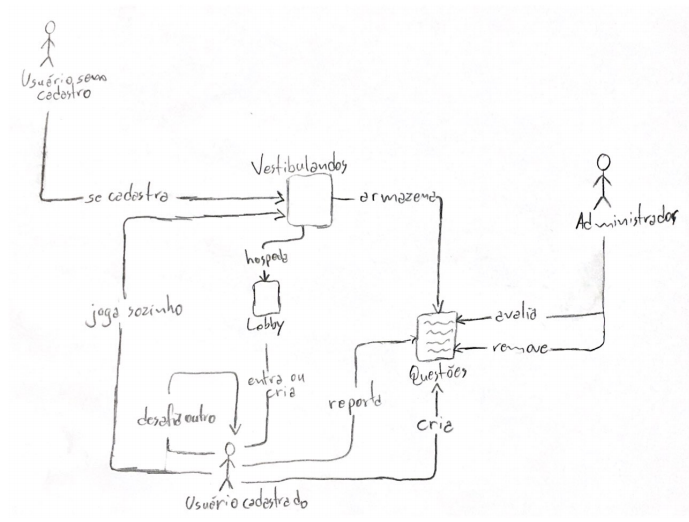
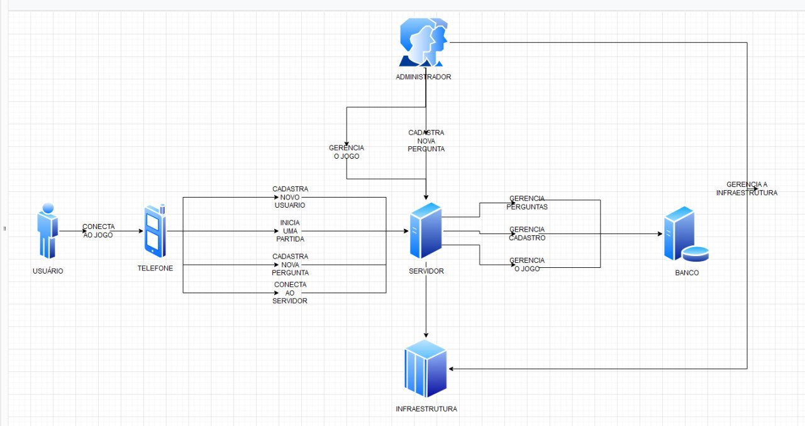
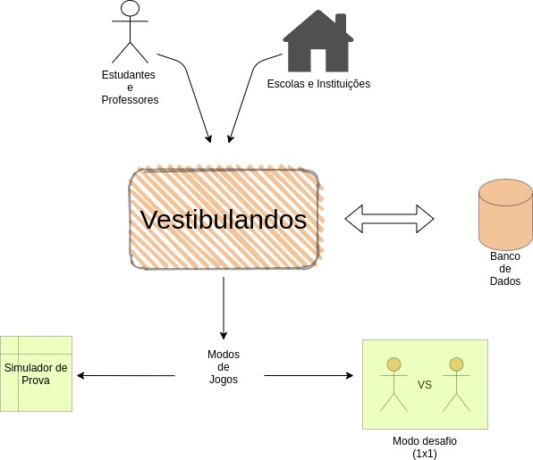
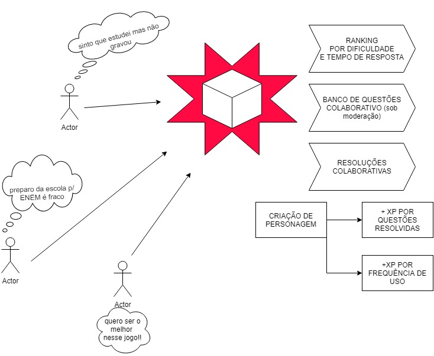
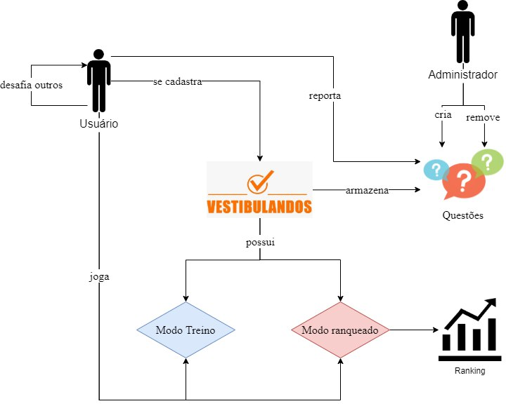

# Rich Picture

## Histórico de versão
|    Data    | Versão |         Descrição         |           Autor(es)            |
| :--------: | :----: | :-----------------------: | :----------------------------: |
| 10/09/2020 |  0.1   |  Criação do documento e adição de rich picture. | [Lucas Silva](https://github.com/lucasgomesgs0) | 
| 11/09/2020 |  0.2   |  Adição de rich picture. | [Julio Litwin](https://github.com/juliolitwin) | 
| 11/09/2020 |  0.3   |  Adição de introdução, metodologia e referências. | [Lucas Silva](https://github.com/lucasgomesgs0) | 
| 11/09/2020 |  0.4   |  Adição de rich picture. | [Guilherme Leal](https://github.com/gleal17) | 
| 11/09/2020 |  0.4   |  Adição de rich picture. | [João Pedro](https://github.com/jpmartins201) | 

## 1. Introdução
O Rich Picture é um desenho que ilustra os principais elementos e relações para modelagem de idéias ou solução de um problema. Por ser uma técnica pouco formal, os desenhos podem ser feitos à mão livre enquanto participa de uma reunião, brainstorming ou em uma conversa com o cliente. É um desenho composto por diferentes tipos de componentes, seja textos, imagens, símbolos e ícones, que são utilizados para ilustrar a idéia.

## 2. Metodologia
Para uma maior reunião de idéias, o grupo decidiu que cada membro criaria um rich picture com o seu entedimento e idéias sobre o tema. Assim, será possível criar um rich picture final com a união das principais idéias de cada rich picture criado.

## 3. Rich Pictures criados pelos integrantes do grupo

## Autor: [Lucas Silva](https://github.com/lucasgomesgs0)

## Autor: [Julio Litwin](https://github.com/juliolitwin)

## Autor: [Guilherme Leal](https://github.com/gleal17)

## Autor: [João Pedro Martins](https://github.com/gleal17)

## 4. Rich Pictures criados pelo grupo

## Versão 1

## 5. Referências
- Material complementar da disciplina Arquitetura e Desenho de Software. VideoAula 02c - DSW - Base - RichPicture. Professora Milene Serrano. Universidade de Brasília.

- Rich Picture. Wageningen University & Research, 2020. Disponível em http://www.mspguide.org/tool/rich-picture. Acesso em: 10/09/2020.

- Rich Pictures. BetterEvaluation, 2020. Disponível em https://www.betterevaluation.org/en/evaluation-options/richpictures. Acesso em: 10/09/2020.
